# Manual de usuario - EnMarcha CRM

Ultima actualizacion: 2026-08-01  
Version del manual: 10.0
Sistema: EnMarcha CRM para gestion comercial y ventas a credito  

## 1. Bienvenida

Este manual explica como usar el CRM en la operacion diaria. Esta dirigido a vendedores, supervisores y administradores que necesitan registrar clientes, crear cotizaciones, hacer seguimiento comercial, gestionar solicitudes de credito, controlar entregas y revisar reportes.

El sistema ayuda a mantener organizada la informacion comercial de la empresa para que cada asesor sepa que cliente atender, que negocio esta pendiente, que documentos faltan y que oportunidades pueden convertirse en venta.

## 2. Conceptos importantes

Antes de usar el sistema, tenga presentes estos conceptos:

- **Cliente:** persona o empresa que ya fue registrada en el sistema. Puede venir desde una cotizacion o ser creado manualmente.
- **Prospecto:** persona interesada que todavia no tiene toda la informacion comercial completa. Puede convertirse en cliente.
- **Cotizacion:** propuesta comercial generada para un cliente, normalmente con producto, precio, cuota inicial y financiacion.
- **Solicitud de credito:** proceso donde se revisan documentos, codeudor, referencias y decision de aprobacion.
- **Pipeline:** tablero visual donde se ve el avance de cada venta por etapas.
- **Actividad:** tarea, llamada o reunion que debe realizarse para hacer seguimiento.
- **Producto:** articulo que se cotiza o vende. Puede ser moto u otro tipo de producto configurado por la empresa.

## 3. Roles de usuario

El acceso a las opciones depende del rol asignado.

### Administrador

Puede administrar empresas, usuarios, productos, configuracion general y consultar toda la informacion comercial.

### Supervisor

Puede revisar la gestion del equipo, consultar reportes, validar seguimiento comercial y apoyar decisiones del proceso.

### Vendedor

Puede crear clientes, cotizaciones, actividades, solicitudes y hacer seguimiento a sus oportunidades de venta.

## 4. Ingreso al sistema

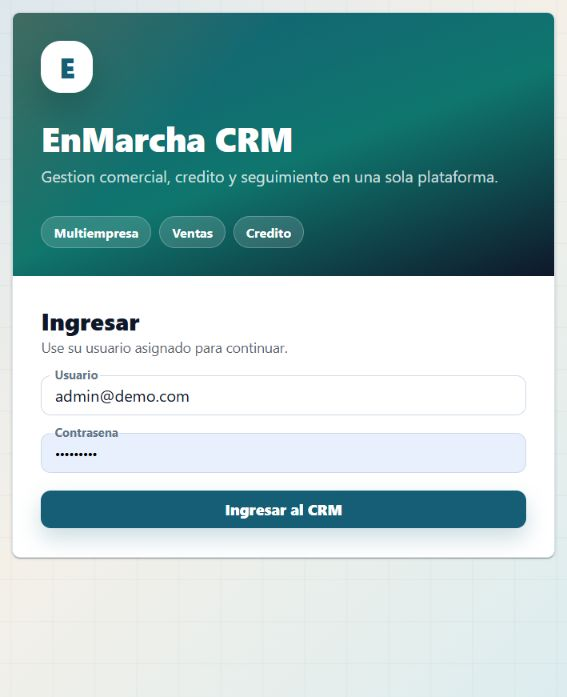

### Para que sirve

La pantalla de ingreso permite entrar al CRM con el usuario o login asignado por el administrador. El correo se conserva en la ficha del usuario, pero el ingreso se realiza con el campo **Usuario**.

### Paso a paso

1. Escriba su **Usuario**.
2. Escriba su contrasena.
3. Presione **Ingresar**.

### Si no puede ingresar

Revise que el usuario y la contrasena esten escritos correctamente. Si el problema continua, solicite al administrador que valide si su usuario esta activo.

## 5. Menu principal

El menu lateral permite moverse por las opciones principales. Para que sea mas facil de usar, las opciones estan organizadas por grupos que se pueden abrir o cerrar.

- **Comercial:** Dashboard, Clientes, Prospectos, Cotizaciones, Pipeline y Actividades.
- **Credito:** Solicitudes de credito y Ordenes de recaudo.
- **Operacion:** Inventario, Tramites y Entregas.
- **Catalogos:** Productos.
- **Reportes:** reportes comerciales.
- **Administracion:** Configuracion de empresas, sedes, usuarios, roles y parametros generales.

El grupo donde se encuentra la pantalla actual se abre automaticamente. Si necesita ver menos opciones, puede cerrar los grupos que no este usando.

En la parte superior se muestra el usuario conectado y la opcion **Salir** para cerrar sesion.

El sistema se adapta a computador, tablet y celular. En pantallas pequenas el menu se abre desde el boton superior, los formularios se muestran en una sola columna cuando es necesario y las tablas amplias se pueden desplazar horizontalmente para conservar el orden de la informacion.

## 6. Dashboard

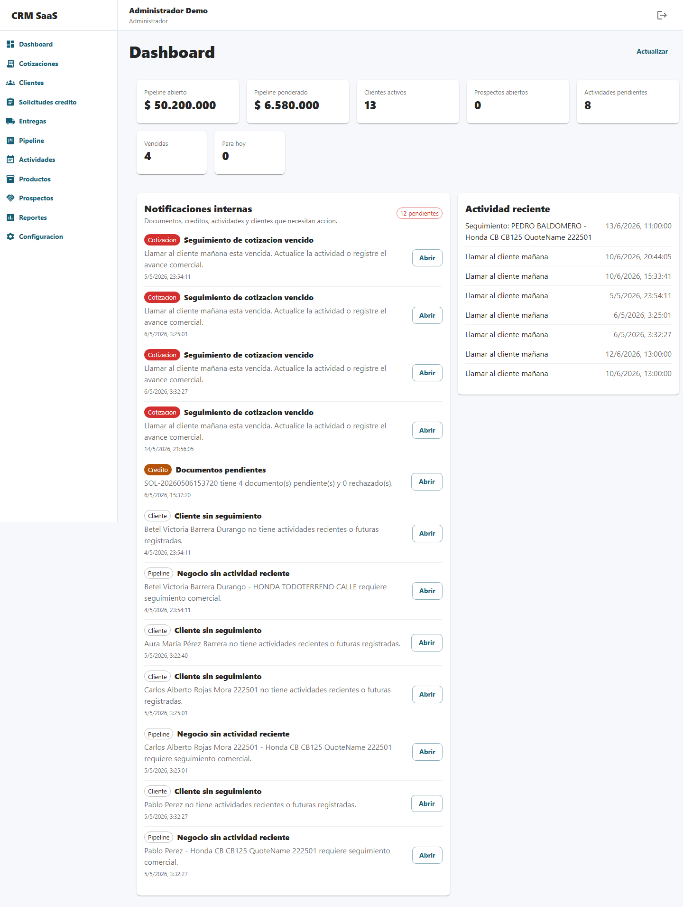

### Para que sirve

El Dashboard muestra el estado general del negocio. Es la primera pantalla para saber que esta pasando y que requiere atencion.

### Informacion que muestra

- **Pipeline abierto:** valor total de negocios que siguen en proceso.
- **Pipeline ponderado:** valor estimado segun la probabilidad de cierre.
- **Clientes activos:** cantidad de clientes registrados y activos.
- **Prospectos abiertos:** interesados que aun no se han convertido en clientes.
- **Actividades pendientes:** seguimientos que todavia no se han completado.
- **Actividades vencidas:** tareas o llamadas que ya debieron realizarse.
- **Actividades para hoy:** gestiones programadas para el dia actual.
- **Notificaciones internas:** alertas sobre documentos, creditos, actividades vencidas o clientes sin seguimiento.
- **Actividad reciente:** ultimos movimientos registrados.

### Recomendacion de uso

Revise el Dashboard al iniciar el dia. Le ayuda a priorizar llamadas, documentos pendientes y negocios que necesitan seguimiento.

## 7. Clientes

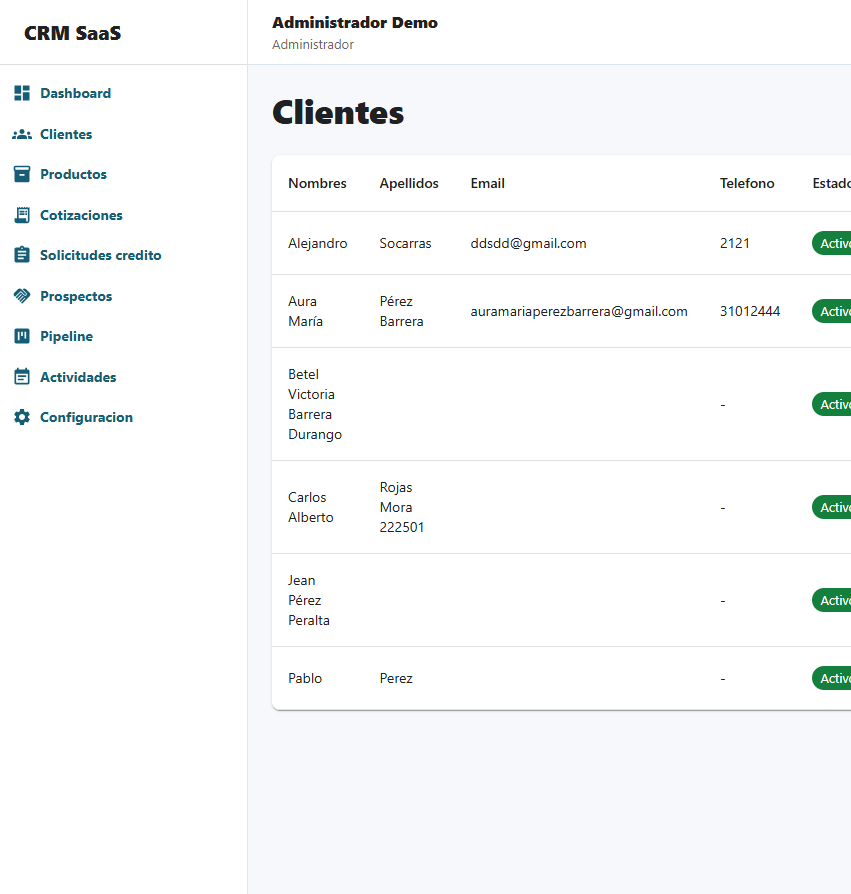

### Para que sirve

El modulo Clientes guarda la informacion principal de las personas o empresas con las que se tiene relacion comercial.

### Crear un cliente

1. Entre a **Clientes**.
2. Presione **Nuevo cliente**.
3. Seleccione el tipo de identificacion.
4. Escriba el numero de identificacion.
5. Complete nombres y apellidos.
6. Registre telefono, indicativo, correo, direccion y ciudad si los tiene.
7. Seleccione el estado del cliente.
8. Presione **Guardar**.

### Editar un cliente

1. Busque el cliente en la lista.
2. Presione la accion de editar.
3. Actualice los datos necesarios.
4. Guarde los cambios.

### Buscar un cliente

En la parte superior de Clientes use el campo **Buscar cliente**. Puede escribir nombre, apellido o telefono. La lista se filtra automaticamente mientras escribe y muestra solo los clientes que coinciden.

Tambien puede usar las **Vistas rapidas** para filtrar clientes por estado, como activos, inactivos, suspendidos o clientes sin telefono registrado.

### Cliente creado desde cotizacion

Cuando se crea una cotizacion, el sistema tambien puede crear el cliente automaticamente con los datos basicos. Despues, desde Clientes, se pueden completar los demas datos.

### Consulta de identidad

Cuando se digita una identificacion, el boton **Consultar** busca primero si el cliente ya existe en la base de datos. Si no existe y la integracion esta configurada, consulta la informacion externa disponible y ayuda a completar nombres y apellidos.

## 8. Cliente 360

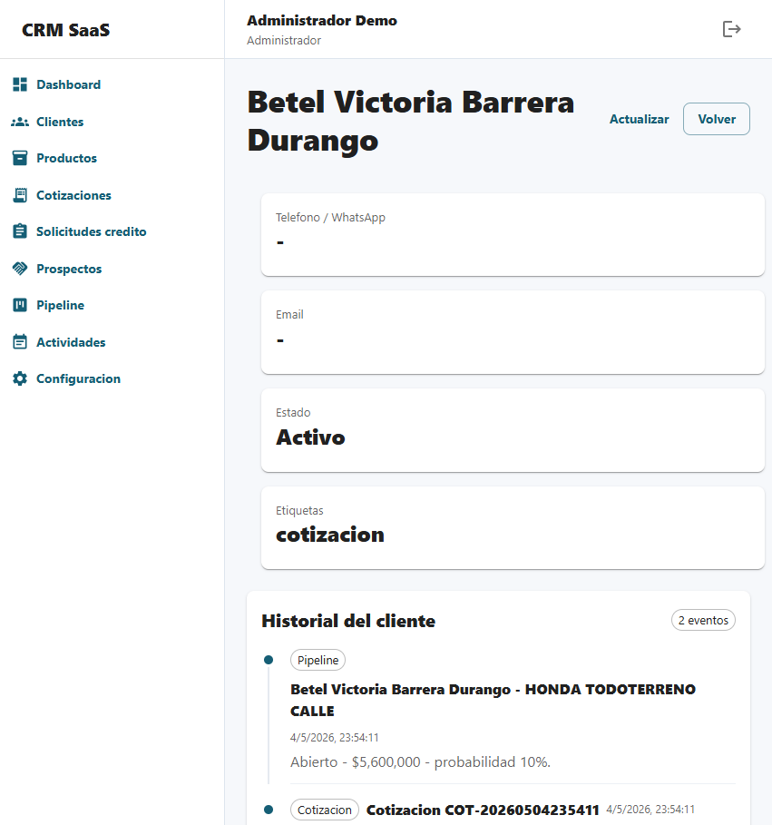

### Para que sirve

Cliente 360 muestra toda la informacion importante de un cliente en una sola ficha comercial. Esta vista ayuda a saber rapidamente quien es el cliente, en que etapa esta, que se le ha cotizado, si tiene solicitud de credito y cual debe ser el siguiente seguimiento.

### Que puede revisar

- Encabezado comercial con estado, identificacion, ciudad, etiquetas y acciones rapidas.
- Accesos para escribir por WhatsApp, enviar email o crear un nuevo seguimiento.
- Resumen rapido de ultima cotizacion, credito actual, pipeline abierto y siguiente accion.
- Indicadores de cotizaciones, valor cotizado, solicitudes, seguimientos y pendientes.
- Datos personales, datos de contacto y resumen comercial.
- Siguiente seguimiento programado y ultimo movimiento registrado.
- Timeline comercial con el historial de eventos del cliente.
- Cotizaciones asociadas.
- Solicitudes de credito y estado de documentos.
- Negocios en pipeline con avance y probabilidad.
- Actividades y seguimientos recientes.
- Documentos, archivos, notas y entregas relacionados.

### Recomendacion de uso

Antes de llamar o escribir a un cliente, abra Cliente 360. La parte superior le muestra el estado del caso y el siguiente paso; el timeline le permite revisar el historial antes de contactar al cliente.

## 9. Productos

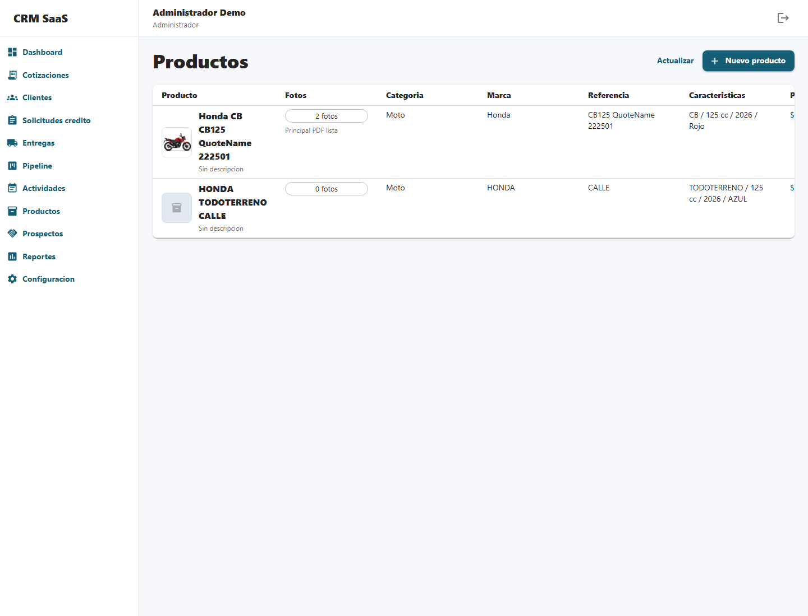

### Para que sirve

El modulo Productos permite administrar lo que la empresa vende o cotiza. Aunque el sistema inicio enfocado en motos, tambien puede manejar otros productos.

En este maestro se define la informacion comercial del articulo, su ficha tecnica, el precio vigente y los cargos que normalmente acompanian la cotizacion.

### Crear un producto

1. Entre a **Productos**.
2. Presione **Nuevo producto**.
3. En **Datos comerciales**, escriba nombre, categoria, marca, modelo, linea, version, referencia y color.
4. En **Ficha tecnica**, complete cilindraje, ano, vigencia del precio y las caracteristicas estructuradas del producto.
5. En **Precio y cargos**, ingrese el precio base, SOAT, matricula e impuestos cuando apliquen.
6. Defina el estado del producto.
7. Guarde.

### Precio y cargos del producto

El **precio base** es el valor comercial del articulo. Los campos **SOAT**, **matricula** e **impuestos** son cargos adicionales que el sistema puede usar automaticamente al crear una cotizacion.

Si esos cargos estan configurados en el producto, al seleccionarlo en una cotizacion se cargan como valores sugeridos para el calculo. El asesor puede ajustarlos antes de guardar si el caso comercial lo requiere.

### Adjuntar fotos al producto

1. Cree o edite el producto.
2. En la seccion **Fotos del producto**, presione **Adjuntar fotos**.
3. Seleccione una o varias imagenes.
4. Revise las miniaturas cargadas.
5. Presione **Usar en PDF** sobre la foto que desea mostrar en la cotizacion.

### Foto para la cotizacion

La foto marcada como **Foto PDF** sera la imagen comercial que aparecera en el PDF de cotizacion. El sistema admite imagenes **JPG/JPEG** y **PNG compatibles** para imprimirlas en el PDF.

### Carga masiva de productos

Esta opcion permite que un administrador suba varios productos al sistema usando una plantilla compatible con Excel.

1. Entre a **Productos**.
2. En **Carga masiva de productos**, presione **Descargar plantilla**.
3. Abra el archivo CSV en Excel.
4. Diligencie una fila por cada producto.
5. Guarde el archivo en formato CSV.
6. Regrese a **Productos** y presione **Subir productos**.
7. Seleccione el archivo diligenciado.
8. Revise el mensaje final con productos creados, actualizados y posibles errores por fila.

La carga masiva crea productos nuevos o actualiza productos existentes usando la **Referencia** como identificador. Solo los usuarios con rol **Administrador** pueden usar esta opcion.

### Sincronizar productos desde inventario

Cuando la empresa tiene inventario conectado y la sede del usuario tiene bodegas configuradas, el administrador puede alimentar el catalogo desde los articulos existentes en esas bodegas. No se escoge sede manualmente: el sistema usa la sede asignada al usuario conectado.

1. Entre a **Productos**.
2. En **Carga masiva de productos**, presione **Sincronizar inventario**.
3. El sistema revisa solo los articulos con existencia en las bodegas configuradas para la sede del usuario.
4. Si la referencia ya existe en el catalogo, la deja igual.
5. Si la referencia no existe, crea el producto como **Pendiente precio**.
6. Edite el producto creado, complete precio, categoria, marca, modelo, cargos o foto si aplica.
7. Active el producto cuando ya este listo para cotizar.

Los productos sincronizados sin precio no quedan listos para cotizacion hasta que el administrador complete el valor comercial y los active.

El listado de productos tambien respeta esta regla: cuando hay inventario conectado, se muestran los productos que existen en las bodegas permitidas para la sede correspondiente.

### Recomendacion de uso

Mantenga precios, modelos, cargos, vigencias y estados actualizados. Una cotizacion depende de que el producto tenga informacion correcta.

## 10. Inventario comercial

### Para que sirve

Inventario comercial permite controlar las unidades disponibles por sede. Aqui se registran seriales, chasis, motor, placa, color, estado, motos usadas y separaciones contra disponibilidad.

### Registrar una unidad

1. Entre a **Inventario**.
2. Revise el resumen por producto y sede.
3. Presione **Nueva unidad**.
4. Seleccione producto y sede.
5. Complete VIN, chasis, motor, placa, color y kilometraje si aplica.
6. Marque si la unidad es usada.
7. Guarde la unidad.

### Separar una unidad

1. Ubique una unidad disponible o usada.
2. Presione **Separar**.
3. Seleccione cliente, cotizacion o solicitud de credito.
4. Defina la fecha de vencimiento de la separacion.
5. Guarde.

Cuando una unidad queda separada, deja de contarse como disponible. Si la venta no continua, use **Liberar** para devolverla a disponibilidad. Si se concreta la venta, use **Vendida**.

### Recomendacion de uso

Registre chasis y motor tan pronto la unidad llegue a la sede. Asi ventas puede separar unidades reales y evitar prometer productos que ya no estan disponibles.

## 11. Cotizaciones

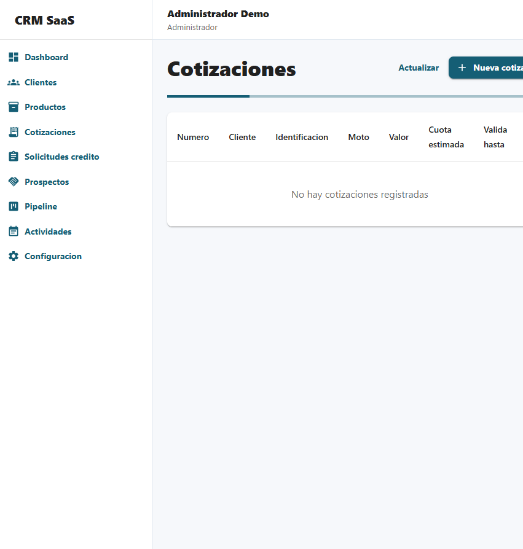

### Para que sirve

Cotizaciones permite generar una propuesta comercial para un cliente. Es uno de los puntos principales del proceso de venta.

El formulario esta organizado en una vista amplia: primero se capturan los datos del cliente y luego los articulos a cotizar, cada uno con producto, cuota inicial, numero de cuotas, seguro, gastos y cuota aproximada.

La cotizacion usa automaticamente la sede principal del asesor conectado. Esa sede define logo de marca, tasa factor mensual, plazo maximo, vigencia y condiciones comerciales impresas en el PDF.

Cuando la empresa tiene inventario conectado, el asesor puede buscar existencias en tiempo real por codigo, nombre, serial, chasis o bodega. El resultado muestra disponibilidad y punto de inventario. Para poder usar un articulo en la cotizacion, el codigo del inventario debe tener su producto equivalente creado en el catalogo del CRM, porque desde alli se toman precio, fotos, categoria y reglas comerciales.

Tambien permite seleccionar un **perfil de requisitos**, por ejemplo Empleado, Independiente, Pensionado o Contado. Ese perfil indica que documentos se deben pedir si el cliente continua hacia solicitud de credito.

Si existe una promocion vigente para el producto, marca, color o sede, la cotizacion aplica el descuento automaticamente antes de calcular el valor financiado y la cuota aproximada.

### Crear una cotizacion

1. Entre a **Cotizaciones**.
2. Presione **Nueva cotizacion**.
3. Seleccione el tipo de identificacion del cliente.
4. Escriba el numero de identificacion.
5. Presione **Consultar** si desea buscar datos existentes o consultar la integracion disponible.
6. Complete primer nombre, segundo nombre, primer apellido y segundo apellido.
7. Ingrese indicativo y telefono. Por defecto se usa el indicativo de Colombia **+57**.
8. Seleccione el **perfil de requisitos** que corresponda al cliente o a la forma de pago.
9. Si desea validar disponibilidad, use **Buscar inventario en tiempo real** y presione **Usar** sobre el articulo encontrado.
10. Si no usa la busqueda de inventario, seleccione manualmente el producto que desea cotizar.
11. Digite la cuota inicial y el numero de cuotas.
12. Si desea comparar varias opciones, presione **Agregar articulo** y seleccione otro producto.
13. Revise la cuota aproximada de cada articulo.
14. Guarde la cotizacion.

### Que ocurre al guardar

- Se crea o actualiza el cliente con los datos correctos.
- Se guarda la cotizacion.
- Se abre una vista previa del PDF en pantalla.
- Desde la vista previa se decide si se descarga o se imprime.
- Si el producto tiene una foto principal compatible, se incluye en el PDF.
- El perfil de requisitos queda guardado para generar el checklist si se crea una solicitud de credito.
- Si aplica una promocion vigente, el descuento queda guardado en la cotizacion y se refleja en el calculo financiero.
- Se puede crear seguimiento automatico para llamar al cliente.
- El negocio puede reflejarse en el pipeline comercial.

### Vista previa del PDF

Despues de guardar una cotizacion, el sistema no imprime ni descarga automaticamente. Primero muestra el PDF en pantalla para que el usuario revise datos del cliente, producto, valores, foto y condiciones. Si todo esta correcto, puede usar **Descargar PDF** o **Imprimir**.

El PDF toma automaticamente el nombre y logo configurados en la empresa. El formato muestra datos del cliente, producto, precio, cuota inicial, alternativas de cuotas, desglose del credito, requisitos generales y texto de autorizacion de datos.

Cuando la cotizacion tiene dos o mas articulos, el PDF muestra un **comparativo** para que el cliente pueda revisar precio, cuota inicial, valor financiado, plazo y cuota aproximada de cada opcion.

## 12. Simulador financiero

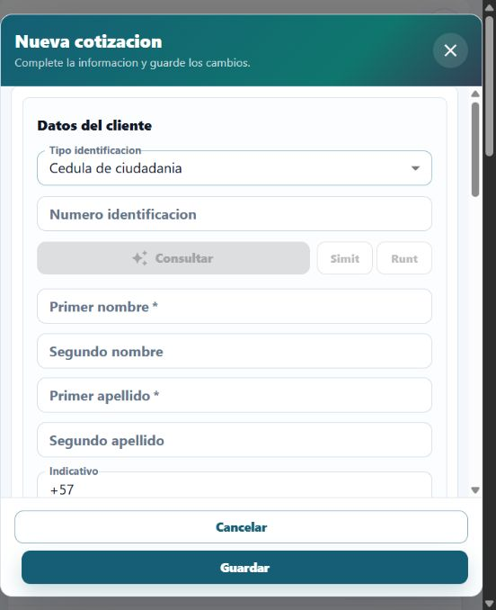

### Para que sirve

El simulador ayuda a estimar rapidamente el valor de la cuota cuando el cliente quiere comprar a credito. Se usa dentro de la cotizacion para que el asesor pueda entregar una propuesta clara antes de continuar con la solicitud de credito.

### Como se usa

1. Seleccione el producto que el cliente desea cotizar.
2. Digite la cuota inicial que el cliente va a entregar.
3. Indique el numero de cuotas.
4. Revise seguro y gastos. Si el producto tiene SOAT, matricula o impuestos configurados, el sistema los trae como valores sugeridos.
5. Revise el total financiado y la cuota aproximada.

### Campos principales

- **Precio del producto:** valor base del producto.
- **Cuota inicial:** dinero que entrega el cliente al inicio.
- **Numero de cuotas:** cantidad de pagos que tendra la financiacion.
- **Seguro:** valor adicional del seguro o SOAT, si aplica.
- **Gastos administrativos:** cobros asociados al proceso, como matricula o impuestos cuando correspondan.
- **Total financiado:** valor que queda pendiente despues de la cuota inicial y cargos.
- **Cuota aproximada:** valor estimado de la cuota mensual.

### Recomendacion de uso

Explique al cliente que la cuota es aproximada y puede cambiar segun la aprobacion final, politicas de credito, documentos entregados o condiciones comerciales vigentes.

## 13. Solicitudes de credito

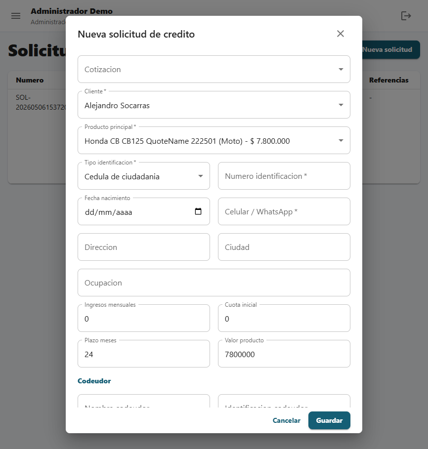

### Para que sirve

Este modulo permite gestionar el proceso de credito del cliente despues de una cotizacion o negocio interesado.

El formulario esta organizado por bloques: origen y cliente, producto y credito, codeudor y referencias, y gestion. Esto permite revisar la solicitud de forma mas rapida antes de guardarla.

Cuando la solicitud viene desde una cotizacion, el sistema puede traer el perfil de requisitos seleccionado en esa cotizacion y crear automaticamente la lista de documentos pendientes.

### Crear o revisar una solicitud

1. Entre a **Solicitudes de credito**.
2. Seleccione o cree la solicitud del cliente.
3. Si viene desde una cotizacion, seleccionela en el campo correspondiente.
4. Revise el **perfil de requisitos**. Puede mantener el que viene de la cotizacion o escoger otro si el caso cambio.
5. Revise los datos del cliente.
6. Complete informacion laboral, financiera o comercial cuando aplique.
7. Registre codeudor y referencias si son requeridos.
8. Adjunte documentos.
9. Actualice el estado de aprobacion.
10. Guarde los cambios.

### Estados comunes

- **Pendiente:** aun falta informacion o revision.
- **En estudio:** la solicitud esta siendo evaluada.
- **Aprobada:** el credito fue aprobado.
- **Rechazada:** el credito no fue aprobado.

### Documentos

Cada solicitud tiene un checklist de documentos ligado al cliente. La lista se genera segun el perfil de requisitos elegido, por ejemplo Empleado, Independiente, Pensionado, Contado u otro perfil definido por la empresa.

Desde la solicitud se puede:

- Adjuntar archivos PDF o imagenes.
- Marcar documentos como pendientes o recibidos.
- Ver la fecha de vigencia de cada documento.
- Identificar documentos vencidos o proximos a vencer.
- Descargar el archivo cargado.

Los usuarios con permiso de supervision pueden validar o rechazar documentos. Si un documento se rechaza, el sistema solicita el motivo para que el asesor sepa que debe corregir o pedir nuevamente.

Cuando todos los documentos quedan recibidos o validados, la solicitud pasa a **Documentos recibidos** y el sistema muestra una alerta para revision del analista. Desde ahi se puede enviar formalmente a estudio, aprobar, rechazar o continuar el flujo correspondiente.

### Estudio formal de credito

El panel de estudio permite al supervisor o administrador controlar la revision antes de aprobar o negar.

1. Use los botones **RUNT** y **SIMIT** para abrir las consultas externas. El sistema copia el numero de identificacion al portapapeles para facilitar la busqueda.
2. Presione **Validacion inicial**.
3. Marque si RUNT fue consultado, si SIMIT fue consultado y si la identidad fue validada.
4. En observaciones, registre el resultado de la revision. Ejemplo: `RUNT y SIMIT consultados sin novedades. Identidad validada con cedula del cliente.`
5. Use **Recalcular** para registrar valor aprobado, cuota inicial aprobada, plazo aprobado y cuota mensual aprobada por el analista.
6. Cuando la solicitud este en estudio, seleccione una decision:
   - **Aprobar:** conserva condiciones normales.
   - **Con ajuste:** aprueba con valores recalculados por el analista.
   - **Con codeudor:** deja la aprobacion condicionada a codeudor registrado.
   - **Negar:** registra el motivo de negacion.
7. Escriba las condiciones finales que deben quedar en la carta.

Para enviar una solicitud a estudio, la **Validacion inicial** debe estar completa y los documentos no pueden estar pendientes o rechazados.

## 14. Codeudor y referencias

### Para que sirve

El codeudor y las referencias ayudan a completar el estudio de credito cuando la politica comercial o financiera lo requiere.

### Cuando se diligencian

Se diligencian dentro de **Solicitudes de credito**, en la solicitud del cliente. Normalmente se completan despues de que el cliente acepta continuar con el proceso y antes de tomar una decision final.

### Recomendacion de uso

Registre datos claros y verificables. Si falta informacion, deje una actividad pendiente para solicitarla al cliente.

## 15. Ordenes de recaudo

### Para que sirve

Ordenes de recaudo permite emitir cobros asociados a una solicitud de credito. La orden separa los conceptos de **vehiculo**, **documentos** y **anticipo** para que el usuario pueda ver claramente cuanto debe pagar el cliente por cada parte.

### Crear una orden

1. Entre a **Ordenes recaudo**.
2. Presione **Nueva orden**.
3. Seleccione la solicitud del cliente.
4. Defina la fecha de vencimiento.
5. Ingrese el valor de vehiculo, documentos y anticipo.
6. Registre el valor pagado si ya existe un abono.
7. Seleccione el estado correspondiente.
8. Guarde.

### Estados

- **Emitida:** orden generada y pendiente de pago.
- **Pagada:** el valor pagado cubre el total de la orden.
- **Parcial:** existe un abono, pero queda saldo pendiente.
- **Vencida:** la fecha de vencimiento paso y no hay pago completo.
- **Anulada:** la orden ya no debe cobrarse.

### Recomendacion de uso

Use la orden de recaudo antes de la entrega para controlar cuota inicial, documentos o anticipos. Si el cliente paga parcialmente, actualice el valor pagado para conservar el saldo real.

## 16. Tramites

### Para que sirve

Tramites permite controlar procesos posteriores o paralelos a la venta, como **SOAT**, **matricula**, **placas** y gestiones con **terceros**. Cada tramite queda ligado a una solicitud, cliente, producto y sede.

### Crear un tramite

1. Entre a **Tramites**.
2. Presione **Nuevo tramite**.
3. Seleccione la solicitud.
4. Seleccione la sede o punto de venta.
5. Escoja el tipo de tramite: SOAT, matricula, placas o terceros.
6. Revise la fecha de inicio y la fecha estimada. Si deja vacia la fecha estimada, el sistema la calcula con los tiempos de la sede.
7. Asigne responsable interno y tercero/proveedor si aplica.
8. Indique si se debe notificar al cliente por WhatsApp.
9. Guarde.

### Estados

- **Pendiente:** aun no inicia o falta gestion.
- **En proceso:** el tramite esta en curso.
- **Completado:** el tramite finalizo.
- **Atrasado:** la fecha estimada ya paso.
- **Cancelado:** el tramite ya no se realizara.

### Notificaciones al cliente

Cuando el tramite tiene marcada la opcion de notificar, la tabla muestra un boton de **WhatsApp**. Ese boton abre WhatsApp con un mensaje sugerido para informar al cliente el estado y la fecha estimada.

### Recomendacion de uso

Revise la lista de atrasados al iniciar el dia. Los tramites atrasados tambien aparecen como alerta interna en el Dashboard.

## 17. Entregas

### Para que sirve

Entregas permite registrar la entrega final del producto cuando el proceso comercial y de credito ya esta listo. Esta opcion ayuda a dejar evidencia del protocolo aplicado, los documentos entregados, la foto de entrega y la primera revision postventa.

### Paso a paso

1. Entre a **Entregas**.
2. Seleccione la solicitud o venta aprobada.
3. Verifique datos del cliente y producto.
4. Complete fecha, asesor, placa, chasis, motor, VIN y kilometraje.
5. Revise o complete el protocolo digital por marca.
6. Adjunte la foto de entrega.
7. Marque el checklist obligatorio: casco, SOAT, matricula, garantia, acta y checklist preentrega.
8. Defina la fecha de primera revision. Si la deja vacia y marca la entrega como entregada, el sistema la agenda automaticamente.
9. Guarde la entrega.

### Campos importantes

- **Protocolo por marca:** instrucciones internas que se deben cumplir antes de entregar el producto.
- **Foto de entrega:** evidencia visual de la entrega al cliente.
- **Acta de entrega firmada:** confirma que el cliente recibio el producto y acepta la entrega.
- **Checklist preentrega completado:** confirma que se revisaron los puntos obligatorios antes de finalizar.
- **Primera revision:** fecha en la que se debe contactar o atender al cliente despues de la entrega.

Cuando una entrega queda en estado **Entregada**, el sistema exige chasis, motor, acta firmada, checklist completo y foto de entrega. Tambien crea automaticamente una actividad de primera revision para dar seguimiento al cliente.

### Recomendacion de uso

Use esta opcion solo cuando el producto realmente vaya a entregarse o ya haya sido entregado. Antes de guardar, confirme que la evidencia y el checklist esten completos para evitar reclamos posteriores.

## 18. Prospectos

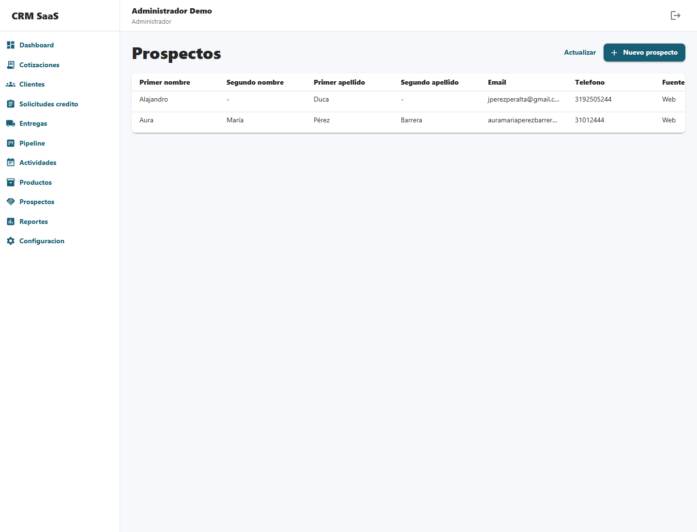

### Para que sirve

Prospectos permite registrar personas interesadas que todavia no son clientes completos.

### Crear un prospecto

1. Entre a **Prospectos**.
2. Presione **Nuevo prospecto**.
3. Complete nombres, apellidos, telefono, correo y fuente del prospecto.
4. Seleccione la calificacion: frio, tibio o caliente.
5. Guarde.

### Convertir prospecto en cliente

Cuando un prospecto muestra interes real, use la opcion de convertir o llevar a cliente. El sistema permite continuar con la creacion del cliente y completar los datos faltantes.

## 19. Pipeline

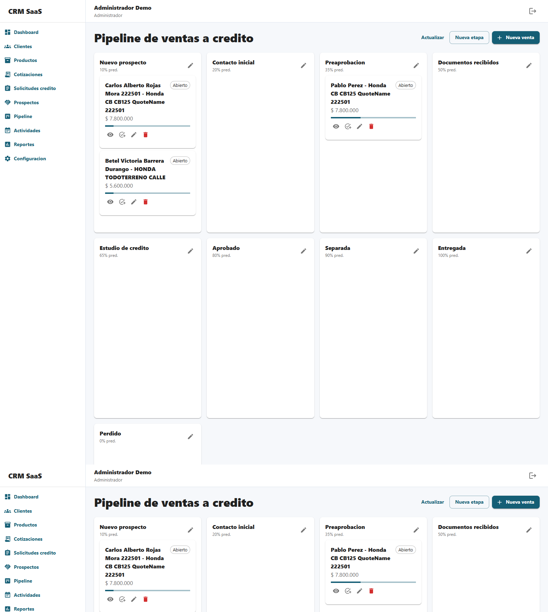

### Para que sirve

El Pipeline muestra las oportunidades de venta por etapas. Funciona como un tablero para saber en que estado esta cada negocio.

### Estados comerciales sugeridos

- **Cotizado**
- **Interesado**
- **Documentos pendientes**
- **Credito en estudio**
- **Aprobado**
- **Rechazado**
- **Entregado**
- **Desistido**

### Mover una oportunidad

Puede mover una tarjeta arrastrandola de una columna a otra. Al hacerlo, el sistema actualiza la etapa del negocio y ajusta la probabilidad segun la etapa.

### Recomendacion de uso

Mantenga el pipeline actualizado todos los dias. Esto permite que el Dashboard y los reportes muestren informacion real.

## 20. Actividades

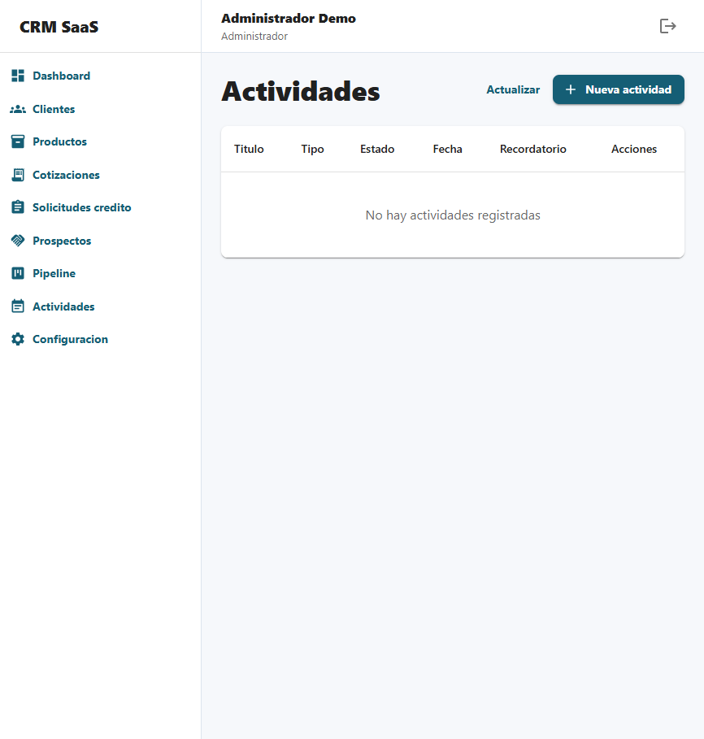

### Para que sirve

Actividades funciona como agenda comercial. Permite programar tareas, llamadas y reuniones para no perder seguimiento.

### Crear una actividad

1. Entre a **Actividades**.
2. Presione **Nueva actividad**.
3. Seleccione el cliente o negocio relacionado.
4. Escoja el tipo: tarea, llamada o reunion.
5. Defina fecha y hora.
6. Escriba la descripcion.
7. Guarde.

### Estados

- **Pendiente**
- **En proceso**
- **Completada**
- **Cancelada**

### Reprogramar una actividad

1. En la lista de actividades, presione el boton **Reprogramar**.
2. Use un acceso rapido como **Hoy**, **Manana**, **En 2 dias** o **Proxima semana**, si aplica.
3. Ajuste la fecha y la hora.
4. Revise el resumen de la nueva programacion.
5. Guarde el cambio.

Si la actividad tenia recordatorio, el sistema conserva la misma anticipacion frente a la nueva fecha programada.

### Seguimiento automatico

Al crear una cotizacion, el sistema puede generar una actividad automatica como **Llamar al cliente manana**. Si no se actualiza, puede aparecer como alerta de seguimiento vencido.

## 21. Reportes comerciales

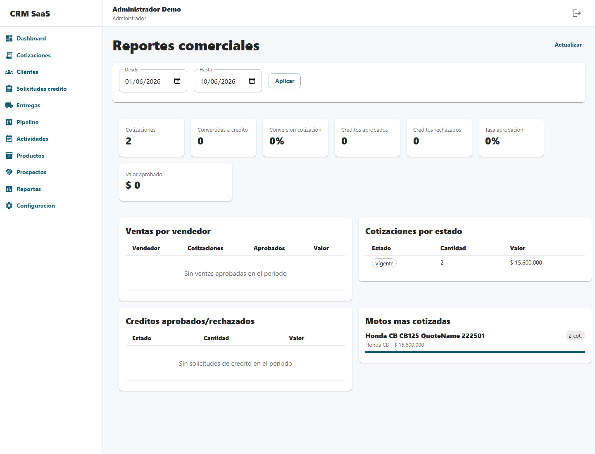

### Para que sirve

Reportes permite revisar resultados comerciales y tomar decisiones con informacion consolidada.

### Indicadores disponibles

- Ventas por vendedor.
- Cotizaciones por estado.
- Tasa de conversion.
- Creditos aprobados y rechazados.
- Productos mas cotizados.

### Recomendacion de uso

El supervisor debe revisar reportes con frecuencia para detectar vendedores con oportunidades vencidas, productos mas consultados y cuellos de botella en credito.

## 22. Configuracion

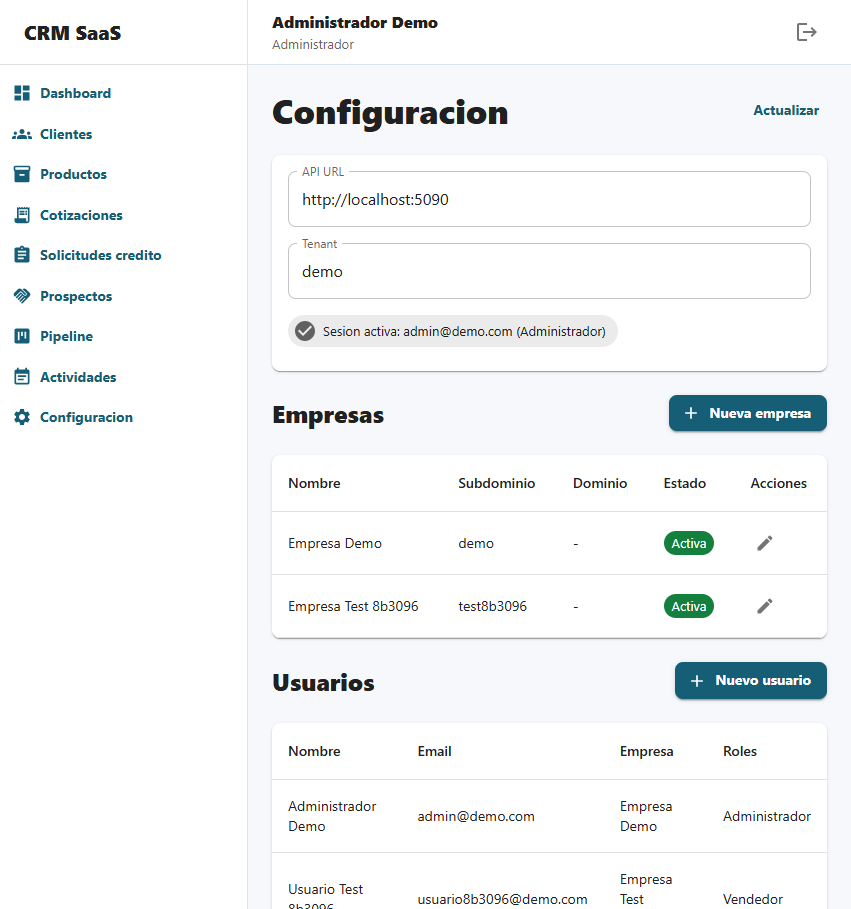

### Para que sirve

Configuracion permite administrar datos generales del sistema. Esta opcion normalmente es usada por administradores.

### Opciones principales

- **Empresas:** crear y actualizar empresas. Al crear una empresa se puede cargar su logo, definir datos generales y configurar la base de datos de inventario que pertenece a esa empresa.
- **Sedes / puntos de venta:** registrar puntos de venta, ciudad, marca principal, logo de marca, modalidad de entrega, tasa, tiempos de tramite y bodegas permitidas.
- **Usuarios:** crear y actualizar usuarios, asignarlos a una empresa, definir su login de ingreso, correo, rol y sede cuando aplique.
- **Roles:** administrar permisos segun el perfil del usuario.
- **Etapas del pipeline:** configurar las columnas comerciales.
- **Configuracion financiera:** definir las condiciones usadas por la empresa para calcular cuotas en las cotizaciones.
- **Perfiles de requisitos:** definir listas de documentos para empleado, independiente, pensionado, contado u otros perfiles propios de la empresa.
- **Promociones / planes tacticos:** configurar descuentos automaticos por producto, marca, color, sede y vigencia.

### Empresas

1. Entre a **Configuracion**.
2. Busque la seccion **Empresas**.
3. Presione **Nueva empresa** o edite una empresa existente.
4. Complete nombre, subdominio, dominio si aplica y logo.
5. Si la empresa consulta inventario externo, escriba la base SQL asignada a esa empresa.
6. Marque la empresa como activa y guarde.

La base de inventario se configura en la empresa porque identifica de donde salen los articulos e inventarios de esa empresa.

### Sedes / puntos de venta

1. Entre a **Configuracion**.
2. Busque la tarjeta **Sedes / puntos de venta**.
3. Presione **Nueva sede**.
4. Complete nombre, codigo, ciudad, direccion y telefono.
5. Indique la marca principal y, si aplica, cargue el logo de marca.
6. Defina tasa factor mensual, plazo maximo, modalidad de entrega y tiempos estimados de SOAT y matricula.
7. Registre proveedor SOAT y tramitador de matricula cuando la empresa ya tenga esos responsables definidos.
8. En **Inventario externo de esta sede**, presione **Cargar bodegas** para traer codigo y nombre desde la tabla **Bodega** de la base configurada en la empresa.
9. Seleccione las bodegas que pertenecen a esa sede.
10. Marque la sede como activa y guarde.

La configuracion de inventario queda separada: la **empresa** define la base de datos de inventario, y cada **sede / punto de venta** define que bodegas de esa base puede usar. Si un vendedor tiene una sede asociada, el inventario que vera en cotizaciones sera el de las bodegas permitidas para esa sede. La seleccion desde la tabla **Bodega** evita errores al escribir codigos manualmente.

### Perfiles de requisitos

1. Entre a **Configuracion**.
2. Busque la tarjeta **Perfiles de requisitos**.
3. Presione **Nuevo perfil** o edite uno existente.
4. Escriba nombre, codigo y descripcion del perfil.
5. Marque si corresponde a una venta de contado.
6. Agregue los documentos que se deben pedir al cliente.
7. Defina el tipo de documento, nombre, orden y si es obligatorio.
8. Guarde.

Estos perfiles se usan en **Cotizaciones** y **Solicitudes de credito**. Al crear la solicitud, el sistema toma el perfil elegido y genera automaticamente el checklist de documentos pendientes.

### Promociones / planes tacticos

1. Entre a **Configuracion**.
2. Busque la tarjeta **Promociones / planes tacticos**.
3. Presione **Nueva promocion**.
4. Escriba nombre y codigo.
5. Defina si el descuento es por valor fijo o por porcentaje.
6. Configure el alcance: producto especifico, marca, color y sede si aplica.
7. Defina fecha inicial y fecha final de vigencia.
8. Guarde.

Cuando una cotizacion coincide con una promocion activa y vigente, el sistema descuenta automaticamente el valor antes de calcular la financiacion. Si varias promociones coinciden, se aplica la mas especifica.

### Configuracion financiera

1. Entre a **Configuracion**.
2. Busque la tarjeta **Configuracion financiera**.
3. Presione **Editar**.
4. Ajuste los parametros de financiacion autorizados por la empresa.
5. Verifique plazo maximo y redondeo de cuota.
6. Guarde.

Los cambios aplican a las nuevas cotizaciones de la empresa. Las cotizaciones ya creadas conservan los valores calculados al momento de generarse.

### Crear usuario

1. Entre a **Configuracion**.
2. Abra la seccion de usuarios.
3. Presione **Nuevo usuario**.
4. Complete nombre, **Usuario / Login**, correo y contrasena temporal.
5. Seleccione la empresa a la que pertenece.
6. Asigne el rol.
7. Si el rol es **Vendedor**, seleccione la sede principal.
8. Si el rol es **Supervisor**, seleccione una o varias sedes a supervisar.
9. Guarde.

El usuario administrador puede editar usuarios desde la misma tabla con el boton de acciones. Al editar, puede cambiar nombre, login, correo, empresa, rol, sede o sedes supervisadas. La contrasena solo cambia si se escribe una nueva; si se deja vacia, se conserva la actual.

La sede principal permite que el sistema pueda separar la informacion comercial por punto de venta. Esta configuracion se usara en cotizaciones, reportes, tramites y entregas.

## 23. Manejo de errores

El sistema muestra mensajes cuando algo no puede completarse.

### Que hacer si aparece un error

1. Lea el mensaje mostrado.
2. Revise campos obligatorios.
3. Valide que la informacion tenga el formato correcto.
4. Intente guardar nuevamente.
5. Si el error continua, tome una captura y reporte al administrador.

### Casos frecuentes

- Falta completar un campo obligatorio.
- El usuario no tiene permiso para la accion.
- La sesion expiro y debe iniciar sesion nuevamente.
- No hay conexion con el servidor.
- La integracion externa no esta configurada o no respondio.

## 24. Buenas practicas

- Registre clientes con identificacion correcta.
- No cree clientes duplicados.
- Complete telefono y correo siempre que sea posible.
- Cree actividades despues de cada contacto importante.
- Actualice el pipeline cuando cambie el estado real de la venta.
- Adjunte documentos en la solicitud de credito.
- Revise notificaciones internas al iniciar el dia.
- Use Cliente 360 antes de contactar al cliente.
- Mantenga productos y precios actualizados.
- Cierre sesion al terminar si usa un equipo compartido.

## 25. Flujo recomendado de trabajo

1. Ingresar al CRM.
2. Revisar Dashboard y alertas.
3. Crear o consultar cliente.
4. Crear cotizacion.
5. Hacer seguimiento con actividades.
6. Si el cliente continua, completar solicitud de credito.
7. Adjuntar documentos, codeudor y referencias si aplica.
8. Registrar estudio de credito y decision.
9. Emitir orden de recaudo si corresponde.
10. Registrar pagos parciales o totales de la orden.
11. Crear y dar seguimiento a tramites de SOAT, matricula, placas o terceros.
12. Actualizar pipeline segun avance.
13. Si se concreta la venta, registrar entrega.
14. Revisar reportes para seguimiento.

## 26. Historial del manual

| Fecha | Version | Cambio |
| --- | --- | --- |
| 2026-08-01 | 10.0 | Se elimina el selector de sede en Productos; el catalogo y la sincronizacion usan automaticamente las bodegas de la sede asignada al usuario. |
| 2026-08-01 | 9.9 | Se ajusta la sincronizacion de productos para seleccionar una sede y usar solo las bodegas configuradas en esa sede. |
| 2026-08-01 | 9.8 | Se agrega sincronizacion del catalogo de productos desde inventario externo y estado Pendiente precio para completar valores antes de cotizar. |
| 2026-08-01 | 9.7 | Se separa la configuracion de inventario: la base de datos pertenece a Empresas y las bodegas permitidas pertenecen a Sedes / puntos de venta. |
| 2026-08-01 | 9.6 | Se revisa la configuracion de inventario para que el usuario consulte segun su sede asociada. |
| 2026-07-31 | 9.5 | Se agrega carga de bodegas desde la tabla Bodega de la base de inventario para seleccionar codigos correctos. |
| 2026-07-31 | 9.4 | Se agrega configuracion de base de datos de inventario por empresa, ademas de bodegas permitidas, para separar inventarios entre empresas. |
| 2026-07-31 | 9.3 | Se agrega configuracion de bodegas externas por empresa para controlar que inventario puede consultar cada empresa en cotizaciones. |
| 2026-07-31 | 9.2 | Se agrega busqueda de inventario externo en tiempo real dentro de Cotizaciones para validar disponibilidad por bodega antes de seleccionar el articulo. |
| 2026-07-31 | 9.1 | Se reorganiza el menu lateral en grupos expandibles para Comercial, Credito, Operacion, Catalogos, Reportes y Administracion. |
| 2026-07-31 | 9.0 | Se mejora la adaptacion del sistema en tablet y celular para menu, encabezados, formularios, tablas, modales y galerias de imagenes. |
| 2026-07-31 | 8.9 | Se mejora Cliente 360 con ficha comercial moderna, resumen superior, acciones rapidas, indicadores, timeline y secciones de proceso mas ordenadas. |
| 2026-07-31 | 8.8 | Se mejora el dashboard con resumen ejecutivo, salud de seguimiento, bandeja de atencion y actividad reciente mas clara. |
| 2026-07-31 | 8.7 | Se modernizan formularios y modales con encabezado visual, cuerpo en panel claro, campos mas limpios, secciones destacadas y botones consistentes. |
| 2026-07-31 | 8.6 | Se unifica el estilo de tablas con filas mas compactas, contador de registros, encabezados claros, acciones consistentes y chips de estado personalizados. |
| 2026-07-31 | 8.5 | Se refuerza el rediseño visual con menu lateral claro, encabezados de modulo con banda de color y pantalla de ingreso renovada. |
| 2026-07-31 | 8.4 | Se moderniza el layout general del frontend con nuevo estilo visual para menu lateral, encabezados, tablas, tarjetas y pantalla de ingreso. |
| 2026-07-31 | 8.3 | Se actualiza el ingreso por Usuario/Login y la administracion de usuarios permite editar login, correo, roles, empresa y sedes segun permisos. |
| 2026-07-16 | 8.2 | Se agrega carga masiva de productos desde Excel para administradores, con descarga de plantilla y validacion por fila. |
| 2026-06-23 | 8.1 | Se renombra Paso 0 como Validacion inicial y se documenta el checklist de RUNT, SIMIT, identidad y observaciones. |
| 2026-06-23 | 8.0 | Se agrega Inventario comercial con stock por sede, seriales, separaciones contra disponibilidad y control de motos usadas. |
| 2026-06-23 | 7.9 | Se fortalece Entregas con protocolo digital, foto de entrega, checklist obligatorio, acta firmada y agendamiento automatico de primera revision. |
| 2026-06-23 | 7.8 | Se agrega el modulo de tramites para SOAT, matricula, placas y terceros, con tiempos por sede, atrasados y notificacion por WhatsApp. |
| 2026-06-23 | 7.7 | Se agrega el modulo de ordenes de recaudo con conceptos separados de vehiculo, documentos y anticipo, estados de pago y control de saldo. |
| 2026-06-22 | 7.6 | Se formaliza el estudio de credito con Paso 0 RUNT/SIMIT, validacion de identidad, recalculo del analista, aprobacion con ajuste o codeudor, negacion y carta de condiciones finales. |
| 2026-06-22 | 7.5 | Se fortalece el gestor de documentos con vigencia, rechazo con motivo, validacion por permisos y alerta cuando el checklist queda completo. |
| 2026-06-22 | 7.4 | Se agregan promociones y planes tacticos con descuentos automaticos por producto, marca, color, sede y vigencia en cotizaciones. |
| 2026-06-22 | 7.3 | Se agregan perfiles de requisitos por empresa y generacion automatica del checklist documental desde la cotizacion hacia la solicitud de credito. |
| 2026-06-22 | 7.2 | Se amplia el maestro de productos con linea, version, ficha tecnica, vigencia de precio, SOAT, matricula e impuestos; la cotizacion puede usar esos cargos automaticamente. |
| 2026-06-22 | 7.1 | Las cotizaciones quedan conectadas a la sede del asesor y usan logo de marca, tasa, plazo, vigencia y condiciones comerciales por sede. |
| 2026-06-22 | 7.0 | Los usuarios pueden quedar asociados a una sede principal para preparar cotizaciones, reportes y tramites por punto de venta. |
| 2026-06-22 | 6.9 | Se agrega el maestro de sedes / puntos de venta en Configuracion y se documenta su uso para condiciones comerciales por sede. |
| 2026-06-17 | 6.8 | Se actualiza el nombre visible del sistema a EnMarcha CRM en el frontend y en el manual. |
| 2026-06-13 | 6.7 | El timeline de Cliente 360 incorpora mas eventos del ciclo comercial, incluyendo archivos generales y entregas. |
| 2026-06-13 | 6.6 | Se mejora Cliente 360 como ficha completa del cliente con encabezado, acciones rapidas, indicadores, resumen comercial, siguiente paso, timeline y paneles de proceso. |
| 2026-06-12 | 6.5 | Se agregan vistas rapidas en Clientes para filtrar la base por estado y clientes sin telefono. |
| 2026-06-12 | 6.4 | Se agrega busqueda interactiva en Clientes por nombre, apellido o telefono. |
| 2026-06-11 | 6.3 | Se reorganiza la solicitud de credito en bloques horizontales para capturar cliente, producto, credito, codeudor, referencias y gestion con mayor orden. |
| 2026-06-11 | 6.2 | Se reorganiza el formulario de cotizacion en una vista mas horizontal para capturar datos del cliente y varios articulos con mayor claridad. |
| 2026-06-10 | 6.1 | Las cotizaciones permiten agregar varios articulos y el PDF muestra un comparativo cuando hay mas de un producto. |
| 2026-06-10 | 6.0 | El PDF de cotizacion adopta un formato comercial con logo/nombre de empresa, datos del cliente, tabla de cuotas, desglose del credito, requisitos y autorizacion de datos. |
| 2026-06-10 | 5.9 | El analisis comercial con IA permite enviar el mensaje sugerido por WhatsApp con el texto listo para el cliente. |
| 2026-06-09 | 5.8 | Se actualizan los pantallazos del manual desde el CRM publicado con una vista mas amplia de las pantallas principales. |
| 2026-06-09 | 5.7 | Se limpia el manual para usuario final, se actualiza el simulador de credito y se retiran referencias internas de configuracion financiera. |
| 2026-06-09 | 5.6 | Se mejora la reprogramacion de actividades con accesos rapidos de fecha, selector de hora y resumen antes de guardar. |
| 2026-06-09 | 5.5 | El boton de actividades ahora se llama Reprogramar y permite escoger fecha y hora de reprogramacion. |
| 2026-06-09 | 5.4 | Se aclara que la cotizacion calcula la cuota desde la tabla financiera de la empresa usando valor del producto, cuota inicial y numero de cuotas. |
| 2026-06-09 | 5.3 | Se agrega configuracion financiera por empresa para cotizaciones, con factor mensual, plazo maximo y redondeo de cuota. |
| 2026-06-09 | 5.2 | La cotizacion ya no descarga ni imprime automaticamente; primero abre vista previa del PDF y luego permite descargar o imprimir. |
| 2026-06-09 | 5.1 | Se documenta la carga de varias fotos por producto, seleccion de foto principal compatible para PDF y mejora visual del PDF de cotizacion. |
| 2026-06-09 | 5.0 | Se reconstruye el manual para usuario final, con explicaciones operativas, paso a paso y recomendaciones de uso. |
| 2026-05-29 | 4.0 | Se agrega movimiento drag and drop en el pipeline para arrastrar negocios entre etapas y actualizar estado/probabilidad automaticamente. |
| 2026-05-27 | 3.9 | La consulta con Verifik guarda automaticamente el cliente cuando la cedula no existia y evita duplicados al crear cotizaciones. |
